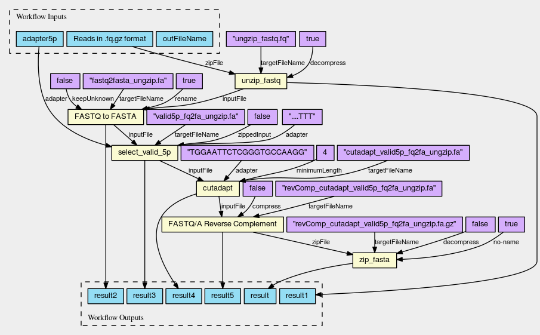

# Mini Test Pipeline for polyA-Site pre-processing
## Objective
This workflow does pre-processing of Aseq data for the polyA pipeline.
Sequencing data are converted to fasta, checked for valid 5'' and 3'' ends and reverse complemented.

## requirements
  - cwl-runner
  - docker/singularity


## How to
Clone the repo:  
`git clone ssh://git@git.scicore.unibas.ch:2222/cwl/CWL_test_pAp.git`  
or if you're not in the zavolab circle of trust, try:  
`git clone https://github.com/ninsch3000/CWL_test_pAp.git`  
In `workflows/cjh_polyA_prepro_WF1.1.yml`:  
```
# Path to your local version of the PolyA Preprocessing pipeline
path2localRepo: /ABSOLUTE/PATH/TO/CWL_test_pAp
```

From your destination folder run:  
`cwltool /PATH/TO/CWL_test_pAp/workflows/cjh_polyA_prepro_WF1.1.cwl /PATH/TO/CWL_test_pAp/workflows/cjh_polyA_prepro_WF1.1.yml`  

If you don't have docker but singularity, you need to run cwltool with `--singularity`.

## Steps
  - gnu_zip fastq
  - fastq_to_fasta
  - rs-filter-by-5p-adapter.keep5pAdapter.pl
  - cutadapt
  - fastx_reverse_complement
  - gzip



For more details browse the graph on [CWL viewer](https://view.commonwl.org/workflows/github.com/ninsch3000/CWL_test_pAp/blob/master/workflows/cjh_polyA_prepro_WF1.1.cwl#)


## Testfiles
Testfiles for every step have been created on the commandline according to the README.md in testfiles folder. Files obtained from running the CWL_test_pAp workflow can be checked with `md5sum -c md5file_cl`
